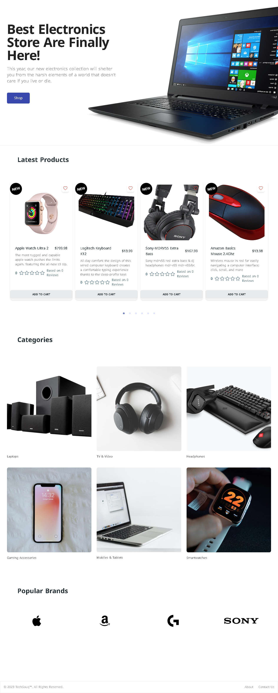

# Techsouq
Multilingual E-commerce Website

in [Section `Features`](#feature)

## Feature
ALL ROLES CAN SWITCH DARK/LIGHT MODE, AND ARABIC/ENGLISH LANGUAGES
1) USER ROLE:
  - Functional shopping cart
  - Adding to favorites
  - Product pagination, searching and filtering features
  - Payment integration using PayPal
  - Latest products carousel
  - Product reviews and ratings
2) SELLER ROLE:
  - Product post untill the ADMIN approves or reject
  - Monitoring the SELLER's products in stock and the SELLER's profits from paid orders
  - Monitoring how many paid/unpaid orders
3) ADMIN ROLE:
  - Dashboard which tells you all products in stock, paid/unpaid orders, total users and weekly profits
  - (Product, Brands, Category, Users) post/delete/update
  - Accept or reject the posted product from the SELLER
  - Mark the order, which was made from user, as delivered
  - Monitor all orders

